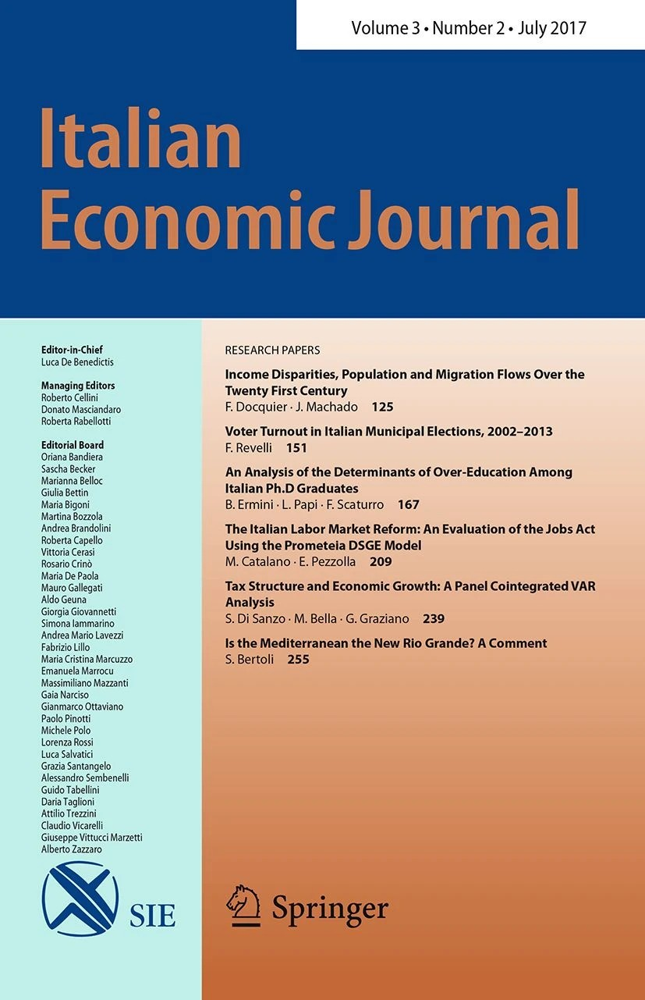
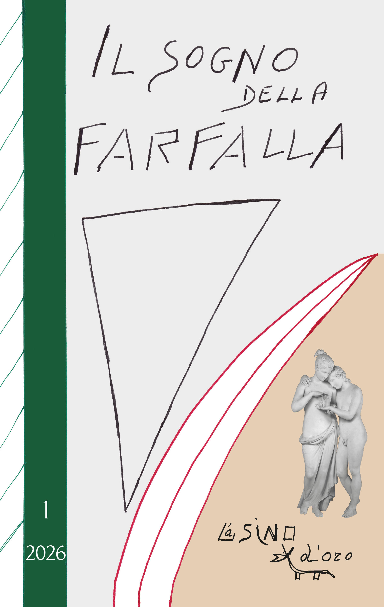
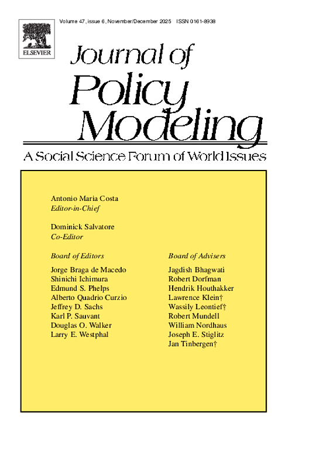
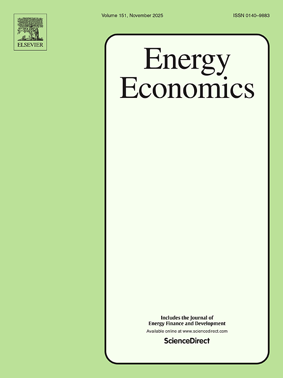
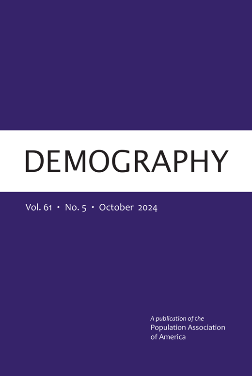
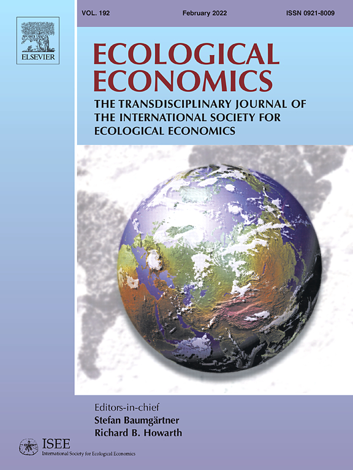
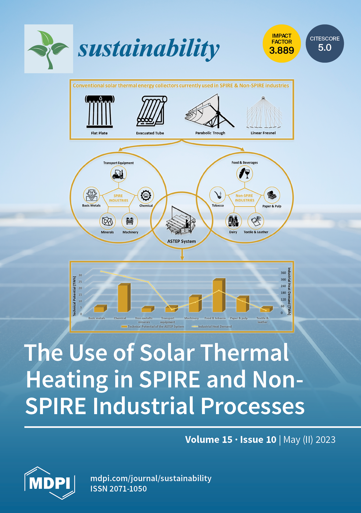
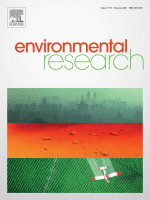

# Peer reviewed publications {#papers}

#### The Path to Sustainability Consciousness: The Role of Subjective Well-Being and Civic Engagement

::: {.grid .mb-5 .align-items-center}

<!-- COLONNA SINISTRA: Immagine del giornale -->
::: {.g-col-12 .g-col-md-3 .text-center}
{width="150px" height="150px" style="object-fit: contain;" alt="Logo7"}
:::

<!-- COLONNA DESTRA: Contenuto del paper -->
::: {.g-col-12 .g-col-md-9}

**Authors:**
Bacci Silvia, Beccari Gabriele, Bertaccini Bruno, and Pettini Anna.

**Journal:**
(2026) Italian Economic Journal

**DOI:**
[https://doi.org/10.1007/s40797-026-00374-5](https://doi.org/10.1007/s40797-026-00374-5)

  
<strong>Abstract</strong>

  

    This study examines how subjective well-being and civic engagement are statistically associated with Sustainability Consciousness, a multidimensional construct that encompasses knowingness, attitudes, and behaviours across environmental, social, and economic dimensions. Using structural equation modelling on data from 1040 Italian youngs aged 12–25, we find that both factors play a significant role in shaping sustainability consciousness, particularly through the impact of personal well-being dimensions such as satisfaction with free time and health, as well as engagement with collective movements such as Fridays for the Future. Our findings underscore the importance of integrating psychological well-being and civic participation into sustainability education and policy, thereby reinforcing the role of both individual and collective agency in fostering sustainable mindsets.
  

  
<strong>Cite</strong>

  

Bacci, S., Beccari, G., Bertaccini, B., and Pettini, A. (2026). *The Path to Sustainability Consciousness: The Role of Subjective Well-Being and Civic Engagement*. Italian Economic Journal. Doi: [https://doi.org/10.1007/s40797-026-00374-5](https://doi.org/10.1007/s40797-026-00374-5).
  

:::

:::

<!-- fine -->

#### Ribellarsi al disumano. Cinquant'anni di La marionetta e il burattino (1974) e Teoria della nascita e castrazione umana (1975)

::: {.grid .mb-5 .align-items-center}

<!-- COLONNA SINISTRA: Immagine del giornale -->
::: {.g-col-12 .g-col-md-3 .text-center}
{width="150px" height="150px" style="object-fit: contain;" alt="Logo6"}
:::

<!-- COLONNA DESTRA: Contenuto del paper -->
::: {.g-col-12 .g-col-md-9}

**Authors:**
Panzera Fernando, Milea Gabriella, and Beccari Gabriele.

**Journal:**
(2026) Il Sogno Della Farfalla, 35(1), 81-114

**DOI:**
[https://doi.org/10.14663/sdf.v35i1.966](https://doi.org/10.14663/sdf.v35i1.966)

  
<strong>Abstract</strong>

  

    The aim of this paper is to reconstruct the historical, political, and cultural context within which Massimo Fagioli developed and published La marionetta e il burattino and Teoria della nascita e castrazione umana, volumes that complete the theoretical trilogy initiated with Death instinct and knowledge (1972). The collected writings derive from presentations made by the authors on April 12, 2025, in Rome, during the first of the "dialogues" promoted by the publisher L'Asino d'oro to celebrate the fiftieth anniversary of these volumes. The contributions explore the contemporary relevance of the Human Birth Theory within the framework of the cultural and social transformations of the second half of the twentieth century, emphasizing Fagioli's critique of traditional psychoanalysis and his engagement with the Italian leftist movements of the 1970s. These reflections aim to highlight how a "rebellion against the inhuman" functions as a dynamic of creativity and transformation, shedding light on the ongoing relationship between psychic reality, human freedom, and social progress.
  

  
<strong>Cite</strong>

  

Panzera, F., Milea, G., and Beccari, G. (2026). *Ribellarsi al disumano. Cinquant'anni di La marionetta e il burattino (1974) e Teoria della nascita e castrazione umana (1975)*. Il Sogno Della Farfalla, 35(1), 81-114. Doi: [https://doi.org/10.14663/sdf.v35i1.966](https://doi.org/10.14663/sdf.v35i1.966).
  

:::

:::

<!-- fine -->

#### Minibonds and investment: do they promote intangible assets?

::: {.grid .mb-5 .align-items-center}

<!-- COLONNA SINISTRA: Immagine del giornale -->
::: {.g-col-12 .g-col-md-3 .text-center}
{width="150px" height="150px" style="object-fit: contain;" alt="Logo5"}
:::

<!-- COLONNA DESTRA: Contenuto del paper -->
::: {.g-col-12 .g-col-md-9}

**Authors:**
Pisicoli Beniamino, Marchionne Francesco, and Beccari Gabriele.

**Journal:**
(2025) Journal of Policy Modeling, Volume 47, Issue 6, pages 1222-1245

**DOI:**
[https://doi.org/10.1016/j.jpolmod.2025.09.006](https://doi.org/10.1016/j.jpolmod.2025.09.006)

  
<strong>Abstract</strong>

  

    This paper examines whether the 2012 introduction of minibonds, a new market-based financial instrument specifically designed for small and medium enterprises, has promoted intangible investments in Italy. We address selection bias by applying a propensity score matching (PSM) and test our hypotheses using a panel Difference-in-Differences (DID) approach. Our results show that minibond-issuing firms invest in intangibles, a component difficult to finance via bank credit, more than other firms and more than they invest in tangibles. We also find that (i) this effect is persistent over time, (ii) minibond-issuing firms attract additional resources from other intermediaries after issuing minibonds, and (iii) alternative financing, such as minibonds, can reduce financial constraints. Results are corroborated by a large number of robustness exercises, including changes in matching criteria, in the matching algorithms, or when resorting to different estimators.
  

  
<strong>Cite</strong>

  

Pisicoli, B., Marchionne, F., and Beccari, G. (2025). *Minibonds and investment: do they promote intangible assets?* Journal of Policy Modeling, Volume 47, Issue 6, pages 1222-1245. Doi: [https://doi.org/10.1016/j.jpolmod.2025.09.006](https://doi.org/10.1016/j.jpolmod.2025.09.006).
  

:::

:::

<!-- fine -->

#### The controversial environmental effects of COVID-19 lockdown on quality of air: evidence from Italian municipalities

::: {.grid .mb-5 .align-items-center}

<!-- COLONNA SINISTRA: Immagine del giornale -->
::: {.g-col-12 .g-col-md-3 .text-center}
{width="150px" height="150px" style="object-fit: contain;" alt="Logo4"}
:::

<!-- COLONNA DESTRA: Contenuto del paper -->
::: {.g-col-12 .g-col-md-9}

**Authors:**
Becchetti Leonardo, Beccari Gabriele, Conzo Gianluigi, Conzo Pierluigi, De Santis Davide, and Salustri Francesco.

**Journal:**
(2025) Energy Economics, 151

**DOI:**
[https://doi.org/10.1016/j.eneco.2025.108904](https://doi.org/10.1016/j.eneco.2025.108904)

  
<strong>Abstract</strong>

  

    This article examines the effect of Italy's first wave COVID-19 lockdown on air quality across municipalities by means of a unified panel specification. We use a continuous province-level mobility index from Google and explicitly separate three channels: reduced outdoor mobility, additional residential heating on cold days, and the legally mandated, asynchronous shutdown of centralised heating across climatic zones. Consistent with expectations, restrictions sharply lowered mobility and increased time spent at home. The overall impact on particulate matter is non-linear and reflects the balance between these forces. During March 2020, intensified home heating coincided with an unusual rise in particulate matter relative to the same months in previous years. The effect reversed in April–May when centralised heating was switched off by law, a pattern corroborated by a regression-discontinuity design around shutdown dates. Nitrogen dioxide declined markedly, in line with reduced traffic and other outdoor activities. A time-series decomposition of the fitted values quantifies the daily contributions of the three channels and reconciles the contrasting March versus April–May patterns. We refrain from short-run policy claims that require assumptions on the electricity mix; our results document and quantify the mechanisms through which the lockdown affected air quality.
  

  
<strong>Cite</strong>

  

Becchetti, L., Beccari, G., Conzo, G., Conzo, P., De Santis, D., and Salustri, F. (2025). *The controversial environmental effects of COVID-19 lockdown on quality of air: evidence from Italian municipalities*. Energy Economics, 151. Doi: [https://doi.org/10.1016/j.eneco.2025.108904](https://doi.org/10.1016/j.eneco.2025.108904).
  

:::

:::

<!-- fine -->

#### Refueling a Quiet Fire: Old Truthers and New Discontent in the Wake of COVID-19

::: {.grid .mb-5 .align-items-center}

<!-- COLONNA SINISTRA: Immagine del giornale -->
::: {.g-col-12 .g-col-md-3 .text-center}
{width="150px" height="150px" style="object-fit: contain;" alt="Logo3"}
:::

<!-- COLONNA DESTRA: Contenuto del paper -->
::: {.g-col-12 .g-col-md-9}

**Authors:**
Beccari Gabriele, Giaccherini Matilde, Kopinska Joanna, and Rovigatti Gabriele.

**Journal:**
(2024) Demography, 61(5), 1613-1636

**DOI:**
[https://doi.org/10.1215/00703370-11587755](https://doi.org/10.1215/00703370-11587755)

  
<strong>Abstract</strong>

  

    This article investigates the factors that contributed to the proliferation of online COVID skepticism on Twitter across Italian municipalities in 2020. We demonstrate that sociodemographic factors were likely to mitigate the emergence of skepticism, whereas populist political leanings were more likely to foster it. Furthermore, pre-COVID anti-vaccine sentiment, represented by "old truthers" on Twitter, amplified online COVID skepticism in local communities. Additionally, exploiting the spatial variation in restrictive economic policies with severe implications for suspended workers in nonessential economic sectors, we find that COVID skepticism spreads more in municipalities significantly affected by the economic lockdown. Finally, the diffusion of COVID skepticism is positively associated with COVID vaccine hesitancy.
  

  
<strong>Cite</strong>

  

Beccari, G., Giaccherini, M., Kopinska, J., Rovigatti, G. (2024). *Refueling a Quiet Fire: Old Truthers and New Discontent in the Wake of COVID-19*. Demography, 61(5), 1613-1636. Doi: [https://doi.org/10.1215/00703370-11587755](https://doi.org/10.1215/00703370-11587755).
  

:::

:::

<!-- fine -->

#### Particulate matter and Covid-19 excess deaths: Decomposing long-term exposure and short-term effects

::: {.grid .mb-5 .align-items-center}

<!-- COLONNA SINISTRA: Immagine del giornale -->
::: {.g-col-12 .g-col-md-3 .text-center}
{width="150px" height="150px" style="object-fit: contain;" alt="Logo2"}
:::

<!-- COLONNA DESTRA: Contenuto del paper -->
::: {.g-col-12 .g-col-md-9}

**Authors:**
Becchetti Leonardo, Beccari Gabriele, Conzo Gianluigi, Conzo Pierluigi, De Santis Davide, and Salustri Francesco.

**Journal:**
(2022) Ecological Economics, 194

**DOI:**
[https://doi.org/10.1016/j.ecolecon.2022.107340](https://doi.org/10.1016/j.ecolecon.2022.107340)

  
<strong>Abstract</strong>

  

    We investigate the time-varying effect of particulate matter ($PM$) on COVID-19 deaths in Italian municipalities. We find that the lagged moving averages of $PM_{2.5}$ and $PM_{10}$ are significantly related to higher excess deceases during the first wave of the disease, after controlling, among other factors, for time-varying mobility, regional and municipality fixed effects, the nonlinear contagion trend, and lockdown effects. Our findings are confirmed after accounting for potential endogeneity, heterogeneous pandemic dynamics, and spatial correlation through pooled and fixed-effect instrumental variable estimates using municipal and provincial data. In addition, we decompose the overall $PM$ effect and find that both pre-COVID long-term exposure and short-term variation during the pandemic matter. In terms of magnitude, we observe that a 1 $\mu g/m^{3}$ increase in $PM_{2.5}$ can lead to up to 20% more deaths in Italian municipalities, which is equivalent to a 5.9% increase in mortality rate.
  

  
<strong>Cite</strong>

  

Becchetti, L., Beccari, G., Conzo, G., Conzo, P., De Santis, D., and Salustri, F. (2022). *Particulate matter and Covid-19 excess deaths: Decomposing long-term exposure and short-term effects*. Ecological Economics, 194. Doi: [https://doi.org/10.1016/j.ecolecon.2022.107340](https://doi.org/10.1016/j.ecolecon.2022.107340)
  

:::

:::

<!-- fine -->

#### The Green Lung: National Parks and Air Quality in Italian Municipalities

::: {.grid .mb-5 .align-items-center}

<!-- COLONNA SINISTRA: Immagine del giornale -->
::: {.g-col-12 .g-col-md-3 .text-center}
{width="150px" height="150px" style="object-fit: contain;" alt="Logo1"}
:::

<!-- COLONNA DESTRA: Contenuto del paper -->
::: {.g-col-12 .g-col-md-9}

**Authors:**
Becchetti Leonardo, Beccari Gabriele, Conzo Gianluigi, Conzo Pierluigi, De Santis Davide, and Salustri Francesco.

**Journal:**
(2023) Sustainability, 15(10), 7802

**DOI:**
[https://doi.org/10.3390/su15107802](https://doi.org/10.3390/su15107802)

  
<strong>Abstract</strong>

  

    In Italy, 25 percent of the 7903 municipalities include protected areas, while 6.4 percent—which we define as park municipalities—are national parks. Using data from the Copernicus programme databases, we investigated the relationship between park municipalities and the air quality, and we found that the air pollution levels in these areas were much lower than in the rest of the municipalities for the period 2017–2020. The gross difference ranged from 25 to 30 percent lower levels of particulate matter (as measured in terms of both $PM_{10}$ and $PM_{2.5}$), and three times lower levels of nitrogen dioxide. In our multivariate econometric analysis, we found that part of this difference depends on the lower population density and manufacturing activity in municipalities with national parks. Furthermore, we showed that park municipalities: (i) had progressively reduced levels of particulate matter during the period 2017–2020, and (ii) had a "green lung" function, since in non-park municipalities' air pollution levels increased with the distance from national parks. Based on empirical evidence on the impact of the main air pollutants on mortality documented in the literature, we calculated that living in park municipalities reduces mortality rates by around 10 percent.
  

  
<strong>Cite</strong>

  

Becchetti, L., Beccari, G., Conzo, G., De Santis, D., Conzo, P., and Salustri, F. (2023). *The Green Lung: National Parks and Air Quality in Italian Municipalities*. Sustainability, 15(10), 7802. Doi: [https://doi.org/10.3390/su15107802](https://doi.org/10.3390/su15107802)
  

:::

:::

#### Air quality and COVID-19 adverse outcomes: divergent views and experimental findings
<!-- SECONDO PAPER -->
::: {.grid .mb-5 .align-items-center}

::: {.g-col-12 .g-col-md-3 .text-center}
{width="150px" height="150px" style="object-fit: contain;" alt="Logo0"}
:::

::: {.g-col-12 .g-col-md-9}

**Authors:**
Becchetti Leonardo, Beccari Gabriele, Conzo Gianluigi, Conzo Pierluigi, De Santis Davide, and Salustri Francesco.

**Journal:**
(2021) Environmental Research, 193, 110556

**DOI:**
[https://doi.org/10.1016/j.envres.2020.110556](https://doi.org/10.1016/j.envres.2020.110556)

  
<strong>Abstract</strong>

  

    *Background* 
The questioned link between air pollution and coronavirus disease 2019 (COVID-19) spreading or related mortality represents a hot topic that has immediately been regarded in the light of divergent views. A first "school of thought" advocates that what matters are only standard epidemiological variables (i.e. frequency of interactions in proportion of the viral charge). A second school of thought argues that co-factors such as quality of air play an important role too. 
*Methods* 
We analyzed available literature concerning the link between air quality, as measured by different pollutants and a number of COVID-19 outcomes, such as number of positive cases, deaths, and excess mortality rates. We reviewed several studies conducted worldwide and discussing many different methodological approaches aimed at investigating causality associations. 
*Results* 
Our paper reviewed the most recent empirical researches documenting the existence of a huge evidence produced worldwide concerning the role played by air pollution on health in general and on COVID-19 outcomes in particular. These results support both research hypotheses, i.e. long-term exposure effects and short-term consequences (including the hypothesis of particulate matter acting as viral "carrier") according to the two schools of thought, respectively. 
*Conclusions* 
The link between air pollution and COVID-19 outcomes is strong and robust as resulting from many different research methodologies. Policy implications should be drawn from a "rational" assessment of these findings as "not taking any action" represents an action itself.
  

  
<strong>Cite</strong>

  

Becchetti, L., Beccari, G., Conzo, G., Conzo, P., De Santis, D., and Salustri, F. (2021). *Air quality and COVID-19 adverse outcomes: divergent views and experimental findings*. Environmental Research, 193, 110556. Doi: [https://doi.org/10.1016/j.envres.2020.110556](https://doi.org/10.1016/j.envres.2020.110556)
  

:::

:::